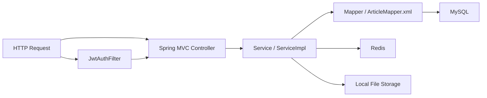

# 01 项目骨架图

## 1. 项目一句话概括

这是一个“内容创作与审核平台”后端，主要支持：

- 用户注册、登录、登出、找回密码
- 作者创建文章、自动保存草稿、提交审核、取消审核、删除草稿
- 管理员审核文章
- 首页聚合、分类页、用户主页、图片上传

技术栈：

- `Spring Boot 3.2.3`
- `Spring Security`
- `MyBatis Plus`
- `MySQL 8`
- `Redis`
- `JWT`
- `Spring Mail`

## 2. 启动入口与全局开关

启动类：`src/main/java/com/platform/NowDemoApplication.java`

它做了 3 件关键事：

- `@SpringBootApplication`：开启 Spring Boot 自动配置
- `@MapperScan("com.platform.mapper")`：扫描 MyBatis Mapper
- `@EnableScheduling`：开启定时任务，供草稿刷盘任务使用

这意味着仓库里不仅有 Web API，还有一个后台定时任务链路。

## 3. 目录职责图

核心目录：

- `config`：Spring 配置，主要是安全、跨域、Redis、MVC、存储
- `controller`：HTTP 接口入口，负责接参、鉴权注解、返回统一 `Result`
- `service` / `service/impl`：真正的业务规则层
- `mapper`：数据库访问层，简单 CRUD 走 MyBatis Plus，复杂查询走 XML
- `entity`：数据库表对应实体
- `dto`：请求体 / 响应体
- `enums`：角色、文章状态、审核动作、阅读时长分类等领域枚举
- `filter`：JWT 认证过滤器
- `exception`：统一异常处理
- `task`：定时任务
- `util`：JWT、统一返回、Security 上下文等工具

## 4. 请求主链路



怎么理解这条链：

- `JwtAuthFilter` 先尝试从请求头拿 `Authorization: Bearer ...`
- 认证通过后，把 `userId` 和角色放进 `SecurityContext`
- `controller` 通过 `SecurityUtils` 拿当前用户身份
- `service` 决定业务规则、权限细节、状态变化、Redis 使用方式
- `mapper` 和 XML 执行数据库查询

## 5. 运行时依赖分层

### 硬依赖

- `MySQL`
  - 几乎所有核心业务都依赖
  - 文章、用户、审核日志都在 MySQL

### 半硬依赖

- `Redis`
  - 登录黑名单
  - JWT 续期
  - 草稿正文缓存
  - 找回密码 token
  - 首页 Hero 每日随机缓存

说明：

- 应用能启动，但很多关键接口在访问时会触发 Redis 依赖
- 对“完整功能可用”来说，Redis 实际上是必备的

### 功能增强依赖

- `Spring Mail`
  - 只影响找回密码邮件发送
- 本地文件系统
  - 只影响图片上传与静态访问

## 6. 关键配置摘要

配置文件：`src/main/resources/application.yml`

关键项：

- 服务端口：`8080`
- 数据库：`content_platform`
- Redis：`localhost:6379`
- JWT：
  - 普通 token 120 分钟
  - remember-me token 10080 分钟
  - 剩余 30 分钟内会在响应头下发 `New-Token`
- 文件访问前缀：`/static/uploads`
- 草稿刷盘间隔：5 分钟
- 提交审核冷却时间：30 分钟

## 7. 全局横切行为

### 安全

`SecurityConfig` 定义了：

- 哪些接口公开
- 哪些接口需要登录
- 哪些接口需要管理员
- 关闭 Session，采用 JWT 无状态认证

### 返回格式

所有接口统一返回：

```json
{
  "code": 200,
  "message": "success",
  "data": {}
}
```

注意：

- 未登录、无权限时，很多情况是 `HTTP 200`，但 `body.code = 401/403`
- 前端不能只看 HTTP 状态码

### 异常处理

`GlobalExceptionHandler` 统一把业务异常、参数异常、上传异常转成 `Result`

### 跨域与静态资源

`WebMvcConfig` 做了两件事：

- 放行开发环境前端端口访问 `/api/**`
- 把 `/static/uploads/**` 映射到本地文件目录

## 8. 先看哪几类文件最有效

如果你要在最短时间内建立地图，顺序建议是：

1. `NowDemoApplication`
2. `application.yml`
3. `SecurityConfig`
4. 所有 `controller`
5. `ArticleServiceImpl`、`AuthServiceImpl`、`ReviewServiceImpl`
6. `entity` 和 `init.sql`
7. `JwtAuthFilter`、`JwtHelper`、`DraftFlushTask`

看完这几类文件，就已经能建立“项目是怎么跑起来的”和“业务是怎么串起来的”的基本心智模型。
