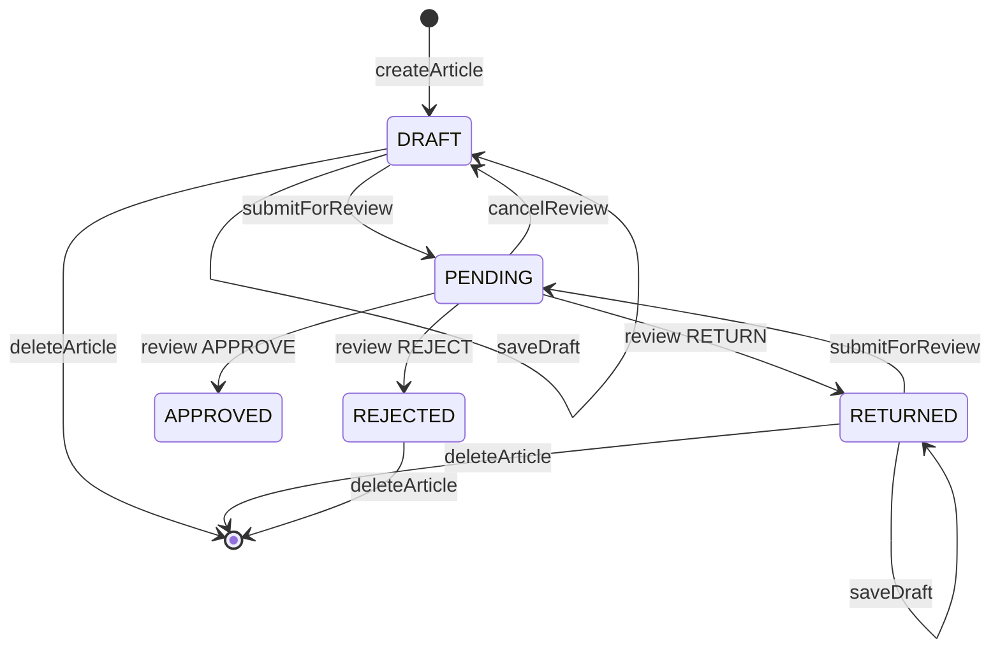

# 03 状态机与主业务链路

## 1. 角色模型

这个项目只有 2 个角色：

| 角色 | 说明 | 典型能力 |
| --- | --- | --- |
| `USER` | 普通作者 | 注册、登录、写文章、保存草稿、提交审核、查看自己的主页和审核日志 |
| `ADMIN` | 管理员 | 具备普通用户能力外，还能查看待审核队列、处理审核动作、查看所有审核日志 |

角色信息来自 JWT 的 `role` claim，进入系统后由 `JwtAuthFilter` 和 `JwtHelper` 解析进 `SecurityContext`。

## 2. 文章状态机



关键理解：

- 新文章一定从 `DRAFT` 开始
- 只有 `DRAFT` 和 `RETURNED` 可以继续编辑、保存、再次提交审核
- `PENDING` 代表进入审核队列
- `APPROVED` 代表公开发布
- `RETURNED` 表示退回修改
- `REJECTED` 表示直接拒绝
- 删除只允许 `DRAFT / RETURNED / REJECTED`

## 3. 认证主线

主链路：

```text
AuthController
  -> AuthServiceImpl
  -> UserMapper / Redis / JwtHelper / JavaMailSender
```

### 注册

- 入口：`POST /api/v1/auth/register`
- 角色要求：公开
- 依赖：
  - MySQL `users`
- 规则：
  - 用户名不能是保留字
  - 用户名和邮箱唯一
  - 密码用 `BCrypt`
  - 注册成功后直接签发 token

### 登录

- 入口：`POST /api/v1/auth/login`
- 角色要求：公开
- 依赖：
  - MySQL `users`
  - JWT
- 规则：
  - `account` 支持用户名或邮箱
  - `rememberMe` 决定 token 过期时间

### 登出

- 入口：`POST /api/v1/auth/logout`
- 角色要求：已登录
- 依赖：
  - Redis `jwt:blacklist:{token}`
- 规则：
  - 把当前 token 放进黑名单
  - TTL 等于 token 剩余时间

### 找回密码

- 入口：
  - `POST /api/v1/auth/forgot-password`
  - `POST /api/v1/auth/reset-password`
- 依赖：
  - Redis `pwd:reset:{uuid}`
  - Redis `pwd:reset:lock:{email}`
  - `Spring Mail`
- 规则：
  - 同一邮箱 15 分钟内限发一次
  - reset token 一次性使用

## 4. 创作主线

主链路：

```text
ArticleController
  -> ArticleServiceImpl / DraftServiceImpl
  -> ArticleMapper / ReviewLogMapper / UserMapper / Redis
```

### 新建草稿

- 入口：`POST /api/v1/articles`
- 角色：作者
- 表：`articles`
- 状态变化：
  - `[无] -> DRAFT`

### 自动保存草稿

- 入口：`PUT /api/v1/articles/{articleId}/draft`
- 角色：作者本人
- 表 / 缓存：
  - MySQL `articles`
  - Redis `draft:{userId}:{articleId}`
- 行为：
  - 正文优先写 Redis
  - 标题、摘要、封面、字数、阅读时长、分类写 MySQL
  - 如果没传摘要，会按正文自动截取

### 读取文章详情

- 入口：`GET /api/v1/articles/{articleId}`
- 角色：公开入口，Service 内二次鉴权
- 表 / 缓存：
  - MySQL `articles`
  - Redis 草稿正文
  - MySQL `review_logs` 用于最近一次退回/拒绝原因
- 关键点：
  - 对草稿类状态，正文会优先读 Redis，而不是数据库里的旧正文

### 提交审核

- 入口：`POST /api/v1/articles/{articleId}/submit`
- 角色：作者本人
- 表 / 缓存：
  - MySQL `articles`
  - Redis 草稿正文
- 状态变化：
  - `DRAFT -> PENDING`
  - `RETURNED -> PENDING`
- 规则：
  - 只能提交 `DRAFT / RETURNED`
  - 标题不能为空
  - 正文至少 50 字
  - 30 分钟内不能重复提交同一篇文章
  - 提交前会把 Redis 最新正文刷回 MySQL

### 取消审核

- 入口：`POST /api/v1/articles/{articleId}/cancel-review`
- 角色：作者本人
- 表：
  - MySQL `articles`
  - MySQL `review_logs`
- 状态变化：
  - `PENDING -> DRAFT`
- 特点：
  - 会写一条 `CANCEL` 审核日志

### 删除文章

- 入口：`DELETE /api/v1/articles/{articleId}`
- 角色：作者本人
- 表 / 缓存：
  - MySQL `articles` 逻辑删除
  - Redis 草稿正文删除

## 5. 审核主线

主链路：

```text
ReviewController
  -> ReviewServiceImpl
  -> ArticleMapper / ReviewLogMapper / UserMapper
```

### 获取待审核列表

- 入口：`GET /api/v1/reviews/pending`
- 角色：管理员
- 表：
  - MySQL `articles`
  - MySQL `users`
- 规则：
  - 只查 `PENDING`
  - 会排除管理员自己提交的文章

### 审核动作

- 入口：`POST /api/v1/reviews/{articleId}/action`
- 角色：管理员
- 表：
  - MySQL `articles`
  - MySQL `review_logs`
- 动作：
  - `APPROVE`
  - `RETURN`
  - `REJECT`
- 状态变化：
  - `PENDING -> APPROVED`
  - `PENDING -> RETURNED`
  - `PENDING -> REJECTED`
- 规则：
  - 文章必须仍然是 `PENDING`
  - 管理员不能审核自己写的文章
  - `RETURN / REJECT` 必须填写原因
  - `APPROVE` 会写 `publishedAt`

### 查看审核日志

- 入口：`GET /api/v1/reviews/{articleId}/logs`
- 角色：
  - 管理员可看任意文章
  - 作者只能看自己的文章
- 表：
  - MySQL `review_logs`
  - MySQL `users`

## 6. 审核动作与日志关系

| 动作 | fromStatus | toStatus | 谁发起 | 是否需要 reason | 是否写入 review_logs |
| --- | --- | --- | --- | --- | --- |
| `APPROVE` | `PENDING` | `APPROVED` | 管理员 | 否 | 是 |
| `RETURN` | `PENDING` | `RETURNED` | 管理员 | 是 | 是 |
| `REJECT` | `PENDING` | `REJECTED` | 管理员 | 是 | 是 |
| `CANCEL` | `PENDING` | `DRAFT` | 作者 | 否 | 是 |

## 7. Redis 在业务中的真实位置

| Redis Key | 用途 | 所属主线 |
| --- | --- | --- |
| `jwt:blacklist:{token}` | 登出后让 token 失效 | 认证 |
| `pwd:reset:{uuid}` | 重置密码 token | 认证 |
| `pwd:reset:lock:{email}` | 找回密码限流 | 认证 |
| `draft:{userId}:{articleId}` | 草稿正文缓存 | 创作 |
| `home:hero:{yyyy-MM-dd}` | 首页 Hero 每日随机缓存 | 首页 |

## 8. 两条必须能手动追踪的请求链路

### `GET /api/v1/home`

链路：

```text
HomeController
  -> HomeServiceImpl.getHomeData
  -> Redis(home:hero:date) / ArticleMapper.selectRandomApproved
  -> ArticleMapper.selectApprovedByCategory
  -> UserMapper.selectBatchIds
  -> HomeResp
```

关注点：

- 首页 Hero 不是每次随机，而是“每天随机一次并缓存”
- section 列表是按 `duration_category` 分类的已发布文章

### `POST /api/v1/articles/{id}/submit`

链路：

```text
ArticleController.submitForReview
  -> SecurityUtils.getCurrentUserId
  -> ArticleServiceImpl.submitForReview
  -> ArticleMapper.selectById
  -> Redis(draft:{userId}:{articleId})
  -> ArticleMapper.updateById
  -> SubmitResp
```

关注点：

- 这是“状态流最集中”的接口
- 同时涉及权限、校验、限流、Redis 与 MySQL 一致性

## 9. 读状态机时最该警惕的风险

高风险点只有 3 类：

- 权限与状态冲突
  - 例如公开接口入口不等于真正公开可见
- 数据库与 Redis 不一致
  - 尤其草稿正文在 Redis，元数据在 MySQL
- 日志与状态变更不同步
  - 审核动作除了改文章状态，还必须写 `review_logs`
