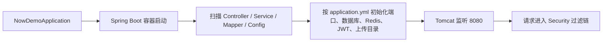

# 启动与配置逐文件讲解

这一篇只讲项目怎么启动、依赖什么、配置项控制什么。读完后你应该知道：项目能跑起来最少依赖哪些外部组件，哪个文件决定端口、数据库、Redis、JWT 和上传目录。

## 1. `NowDemoApplication.java`

文件：`src/main/java/com/platform/NowDemoApplication.java`

这个文件只有一件事：把 Spring Boot 应用启动起来。但它身上的 3 个注解决定了整个项目的运行边界。

- `@SpringBootApplication`
  - 打开 Spring Boot 自动配置。
  - 扫描 `com.platform` 包及其子包中的 `Controller / Service / Config / Component`。
- `@MapperScan("com.platform.mapper")`
  - 告诉 MyBatis 去扫描 `mapper` 接口。
  - 没有它的话，`ArticleMapper / UserMapper / ReviewLogMapper` 这些 Bean 不会被注册。
- `@EnableScheduling`
  - 打开定时任务。
  - 直接影响 [DraftFlushTask](./10-supporting-files-walkthrough.md) 是否执行。没有它，Redis 草稿不会定时刷回 MySQL。

怎么读这个文件：

- 不要只看 `main()`，重点看注解。
- 看到定时任务问题时，先回到这里确认 `@EnableScheduling` 还在不在。

改需求时的入口判断：

- “为什么 Mapper 注入失败”先看这里。
- “为什么定时任务不执行”先看这里。

## 2. `pom.xml`

文件：`pom.xml`

这是项目的技术栈总表。你看不懂某个类来自哪里，回到这里基本都能定位。

### 核心依赖

- `spring-boot-starter-web`
  - 提供 MVC、Tomcat、JSON 接口能力。
- `spring-boot-starter-security`
  - 提供认证、鉴权、过滤器链、`@PreAuthorize`。
- `mybatis-plus-spring-boot3-starter`
  - 提供 `BaseMapper`、分页插件、逻辑删除、自动填充。
- `mysql-connector-j`
  - MySQL 驱动。
- `spring-boot-starter-data-redis`
  - Redis 访问能力，用于草稿缓存、密码重置、Token 黑名单。
- `jjwt-*`
  - JWT 生成和解析。
- `spring-boot-starter-mail`
  - 找回密码邮件。
- `spring-boot-starter-validation`
  - `@Valid`、`@NotBlank` 等参数校验。

### 你读到的几个重要结论

- 项目是标准的 `Spring Boot 3 + Security + MyBatis Plus + MySQL + Redis + JWT` 架构。
- 没有 MQ、没有 ES、没有分布式任务框架，复杂度整体可控。
- 搜索目前只是接口占位，不是搜索引擎项目。

### 运行所需的最小依赖

必须可用：

- JDK 17
- MySQL
- Redis

功能增强但可后补：

- SMTP 邮箱配置
- 实际上传目录

注意点：

- `jjwt` 当前版本是 `0.12.7`，而 `JwtHelper` 里按 Base64 key 解析，生产环境必须给足够强的密钥。
- `kaptcha` 这个依赖目前更像预留或历史遗留，当前主链路里不是核心。

## 3. `application.yml`

文件：`src/main/resources/application.yml`

这个文件决定“应用跑在哪、连谁、把文件放哪、JWT 怎么签、草稿多久刷盘一次”。

### `server`

- `port: 8080`
- `context-path: /`

影响：

- 前端默认请求目标就是 `http://localhost:8080`。

### `spring.datasource`

- 连接数据库 `content_platform`
- 使用 MySQL 驱动
- 用户名从环境变量 `DB_USERNAME` 读取，默认 `root`
- 密码从环境变量 `DB_PASSWORD` 读取
- URL 里带了 `allowPublicKeyRetrieval=true`

这里是你前面遇到数据库连接报错时最先要看的地方。

### `spring.data.redis`

- 默认 `localhost:6379`
- 使用 `database: 0`

项目里 Redis 用途非常多：

- 草稿正文缓存
- Token 黑名单
- 找回密码重置令牌
- 找回密码发送频率限制
- 首页 Hero 每日随机缓存

### `spring.mail`

- 用于找回密码邮件。
- 开发阶段可以先不配，但“忘记密码”功能会失败。

### `mybatis-plus`

- `mapper-locations: classpath:mapper/*.xml`
  - 指定 `ArticleMapper.xml` 的位置。
- `logic-delete-field: deleted`
  - 说明 `articles.deleted` 是逻辑删除字段。
- `map-underscore-to-camel-case: true`
  - 数据库下划线字段自动映射成 Java 驼峰。
- `log-impl: StdOutImpl`
  - 开发时打印 SQL，排查问题很方便。

### `jwt.token`

- `expiration: 120`
  - 普通登录默认 2 小时。
- `remember-me-expiration: 10080`
  - 记住我 7 天。
- `sign-key`
  - JWT 签名密钥。
- `refresh-threshold: 30`
  - 剩余有效期不足 30 分钟时，响应头下发 `New-Token`。

这是理解“为什么前端要监听 `New-Token`”的根源。

### `storage`

- `upload-path`
  - 文件实际落盘目录。
- `access-prefix`
  - 访问 URL 前缀。
- `allowed-types`
  - 允许上传的 MIME 类型。
- `max-file-size`
  - 业务层上传大小上限。

上传问题一般分成两类：

- 文件没写进磁盘：看 `upload-path`
- 文件写进去了但访问不到：看 `access-prefix` 和 `WebMvcConfig`

### `platform`

- `submit-review-cooldown-minutes: 30`
  - 同一篇文章 30 分钟内不能连续提交审核。
- `draft-cache-ttl-days: 7`
  - 草稿正文在 Redis 保留 7 天。
- `draft-flush-interval-minutes: 5`
  - 草稿刷盘周期。
- `reset-pwd-token-ttl-minutes: 15`
  - 重置密码链接有效期。
- `frontend-base-url`
  - 密码重置邮件里拼接前端地址。

### 这份配置文件最容易踩的坑

- `jwt.token.sign-key` 默认值只是开发占位，不适合生产。
- 当前 `JwtHelper` 按 Base64 解码签名密钥，环境值如果不是合法 Base64，会在运行时报错。
- `DraftFlushTask` 的执行周期写死在代码里，而 `application.yml` 里也有一个 `draft-flush-interval-minutes`。这意味着配置和代码目前并没有真正打通，后面如果要做成可配置，应该优先改任务类。
- 上传业务层限制是 5MB，但配置里写了 10MB，Spring multipart 又是 15MB。现在存在“三套大小限制”，维护时要注意统一。

## 4. 先建立一个运行心智模型

只看这 3 个文件，可以先得到这张图：

如果项目“根本起不来”，先看这三处：

1. `pom.xml` 依赖是否完整。
2. `application.yml` 外部资源配置是否可连通。
3. `NowDemoApplication.java` 注解是否还保持完整。
