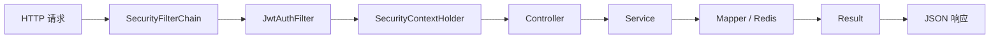

# 认证与请求链路逐文件讲解

这一篇讲的是“一个请求进来后，先经过什么，再到 Controller”。它是理解全项目最关键的一组文件。

## 总体链路



## 1. `SecurityConfig.java`

文件：`src/main/java/com/platform/config/SecurityConfig.java`

这是整个项目的“访问规则总开关”。

### 它做了什么

- 关闭 CSRF
  - 因为项目是前后端分离 + JWT，无状态，不走服务端 Session 表单站点模式。
- 关闭 Session
  - `SessionCreationPolicy.STATELESS`
- 配置路由级权限
- 配置未登录和无权限时如何返回 JSON
- 把 `JwtAuthFilter` 插入到安全过滤链里

### 最重要的权限划分

公开访问：

- `/static/**`
- `/api/v1/auth/**`
- `GET /api/v1/home`
- `GET /api/v1/categories/**`
- `GET /api/v1/search/**`
- `GET /api/v1/articles/{articleId}`
- `GET /api/v1/users/*/profile`

要求登录：

- `/api/v1/reviews/*/logs`
- 其他默认未放行的接口

要求管理员：

- `/api/v1/reviews/**`
- `/api/v1/admin/**`

### 两个必须记住的细节

- 这个项目未登录和无权限时，HTTP 状态码仍然写 `200`，真正的业务状态码放在 `Result.code`。
- `/api/v1/reviews/**` 在这里被整体限制为 `ADMIN`，但 `ReviewController` 又用 `@PreAuthorize("isAuthenticated()")` 想放行日志接口给作者访问。这两个规则叠在一起时，路由级规则优先拦截，文档阅读时一定要意识到这里存在设计张力。

改需求时先看这里的场景：

- 新增公开接口
- 调整某个模块是否要求登录
- 调整管理员接口范围

## 2. `JwtAuthFilter.java`

文件：`src/main/java/com/platform/filter/JwtAuthFilter.java`

这个过滤器是“每次请求都尝试解析 JWT”的地方。

### 它的职责

- 从请求头提取 `Authorization: Bearer <token>`
- 先去 Redis 查黑名单
- 再用 `JwtHelper` 解析 token
- 解析成功后把登录态放进 `SecurityContextHolder`
- 如果 token 快过期，就给响应头写 `New-Token`

### 为什么它重要

因为后面的 `Controller` 根本不自己解析 token，而是统一通过 `SecurityUtils.getCurrentUserId()` 读当前登录人。这件事的前提，就是过滤器已经把认证信息放到上下文里。

### 设计上的取舍

- 项目没有把完整 `UserDetails` 放进上下文，只放了 `userId` 和角色。
- 好处是简单、轻量。
- 代价是如果某些地方想直接从安全上下文里拿昵称、邮箱，就拿不到，必须再查库。

### 前端为什么必须读 `New-Token`

因为这里做了“临近过期续签”，续签结果不是放在响应体，而是放在响应头。前端如果不处理，会出现：

- 当前请求能成功
- 过一会下一次请求突然 401

## 3. `JwtHelper.java`

文件：`src/main/java/com/platform/util/JwtHelper.java`

这个类只负责 JWT 本身，不关心业务。

### 它负责的事

- 创建 token
- 解析 token
- 提取 `userId / username / role`
- 判断是否过期
- 判断是否需要刷新

### token 载荷结构

- `subject = userId`
- `claims.username = username`
- `claims.role = role`

这意味着：

- 登录态最小可用信息已经写进 token。
- 不需要每次请求都查库校验用户身份。

### 你需要关注的实现点

- `getSigningKey()` 使用 Base64 解码 `sign-key`
- `resolveJwt()` 把角色转换成 `ROLE_USER / ROLE_ADMIN`
- `shouldRefresh()` 用剩余分钟数判断是否续签

### 典型风险点

- 环境里的 `sign-key` 不是合法 Base64 时会直接挂。
- 角色如果写入格式变化，`hasRole()` 和 `@PreAuthorize` 都会受影响。

## 4. `SecurityUtils.java`

文件：`src/main/java/com/platform/util/SecurityUtils.java`

这是 Controller 层最常用的小工具。

### 它提供什么

- `getCurrentUserId()`
- `isAdmin()`
- `isAuthenticated()`

### 为什么它存在

Controller 不需要碰 `SecurityContextHolder` 这些底层 API，直接拿当前用户 ID 即可。你会在几乎所有需要登录的接口里看到：

```java
Long userId = SecurityUtils.getCurrentUserId();
```

理解这点后，看 Controller 会轻松很多。

## 5. `Result.java`

文件：`src/main/java/com/platform/util/Result.java`

这是全项目统一响应格式。

### 固定结构

- `code`
- `message`
- `data`

### 为什么它重要

因为这个项目很多错误并不是靠 HTTP 状态码表达，而是靠 `Result.code` 表达。前端如果只看 `axios` 是否进入成功回调，会误判。

### 常见快捷方法

- `ok`
- `badRequest`
- `unauthorized`
- `forbidden`
- `notFound`
- `conflict`
- `tooManyRequests`
- `serverError`

## 6. `GlobalExceptionHandler.java`

文件：`src/main/java/com/platform/exception/GlobalExceptionHandler.java`

这个类把“异常”统一收口成 `Result`。

### 它处理的异常类型

- `BusinessException`
- `MethodArgumentNotValidException`
- `BindException`
- `ConstraintViolationException`
- `HttpMessageNotReadableException`
- `AuthenticationException`
- `AccessDeniedException`
- `MaxUploadSizeExceededException`
- 兜底 `Exception`

### 读代码时最该知道的事

- 参数校验失败会被统一翻译成 400。
- 业务规则冲突通常走 `BusinessException`。
- 未知异常最后被统一转成 500，不会把栈暴露给前端。

## 7. `BusinessException.java`

文件：`src/main/java/com/platform/exception/BusinessException.java`

这就是业务层主动“抛给前端看的错误”。

它和普通异常的区别是：

- 它是可预期的
- 带明确 `code`
- 可选 `details`

你在 Service 里看到 `BusinessException.conflict(...)`，基本就能知道：这是规则不允许，不是程序崩了。

## 8. 这组文件一起看时要形成的理解

一个受保护接口的大致过程是：

1. 请求进入 `SecurityFilterChain`
2. `JwtAuthFilter` 提取 token
3. `JwtHelper` 解析 token
4. 登录信息写入 `SecurityContextHolder`
5. `Controller` 通过 `SecurityUtils` 读取当前用户
6. `Service` 执行业务
7. 成功返回 `Result.ok(...)`
8. 失败则抛 `BusinessException` 或其他异常，由 `GlobalExceptionHandler` 统一转成 `Result`

如果以后排查“为什么前端明明收到 200 但实际还是报错”，先回头看这组文件。
