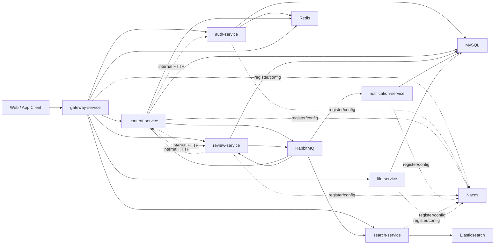
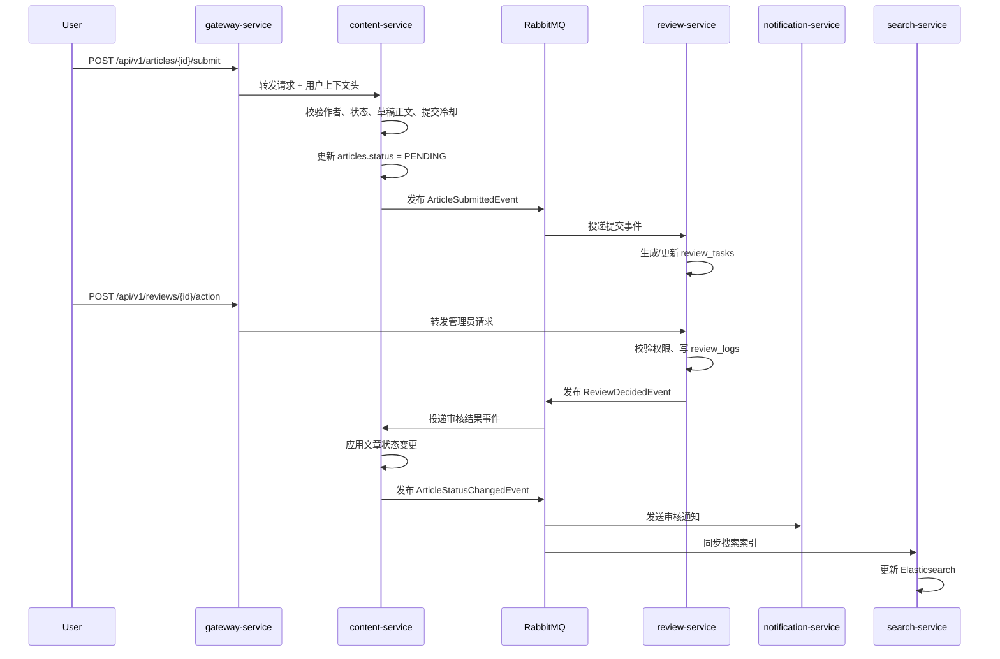

# 分布式改造总体设计文档

## 1. 项目背景
当前项目是一个单体 Spring Boot 内容平台，已经具备完整的后端业务骨架，覆盖以下能力：

- 用户注册、登录、登出、找回密码
- 作者创建文章、自动保存草稿、提交审核、撤回审核、删除草稿
- 管理员查看待审核列表、执行通过/退回/拒绝、查看审核日志
- 首页聚合、分类页、用户主页、图片上传

当前技术栈以 `Spring Boot 3.2.3 + Spring Security + MyBatis Plus + MySQL + Redis + JWT` 为主，数据库核心表为 `users`、`articles`、`review_logs`，Redis 当前用于：

- `jwt:blacklist:{token}`：登出黑名单
- `pwd:reset:{uuid}`：找回密码 token
- `pwd:reset:lock:{email}`：找回密码限流
- `draft:{userId}:{articleId}`：草稿正文缓存
- `home:hero:{yyyy-MM-dd}`：首页 Hero 每日缓存

当前搜索接口已经开放，但 `SearchServiceImpl` 仍是占位实现，尚未接入真实检索能力。

## 2. 改造目标
本次分布式改造的目标不是为了机械增加代码量，而是将现有单体项目升级成一个“服务边界清晰、链路完整、取舍明确、适合面试讲解”的微服务项目。

本次改造固定采用以下策略：

- 先拆服务，后拆库
- 保持外部 API 尽量兼容，继续使用 `/api/v1/**`
- 优先完成一条完整异步链路：`提交 -> 审核 -> 状态回写 -> 通知 -> 索引`
- 不引入 Seata，不做强一致分布式事务

改造后的项目必须能清楚回答这些问题：

- 为什么这样拆服务
- 为什么先共享库后拆库
- 为什么审核链路改成异步
- 最终一致性、幂等、重试、死信如何落地
- 为什么搜索、通知、上传适合独立服务

## 3. 当前单体现状与问题
当前单体项目的模块边界已经初步形成，但仍然运行在同一个进程内，存在以下问题：

1. 业务边界已出现，但数据访问仍然是单体直连。
当前 `ArticleServiceImpl`、`ReviewServiceImpl` 等实现类可以直接访问 `users`、`articles`、`review_logs`，拆分后这些同步直查会成为服务边界冲突点。

2. 审核主链路是同步串行流程。
文章提交审核后，内容状态变更、审核日志、后续扩展动作都依赖同步调用，不利于扩展通知、搜索索引、运营投影等能力。

3. 鉴权职责分散在单体内部。
当前每个服务模块都依赖 `JwtAuthFilter` 和 `SecurityUtils`，分布式后应将身份解析收敛到网关，避免下游服务重复解析 JWT。

4. 搜索能力尚未成型。
当前搜索仍是空实现，只保留了接口形状，正适合作为分布式第二阶段的独立服务切入点。

5. 上传、通知、审核、搜索这些天然可拆能力尚未独立。
当前它们都在单体中运行，缺少“异步解耦 + 独立扩缩容 + 独立故障隔离”的设计表达。

## 4. 技术选型与选型理由
本次改造采用 `Spring Cloud Alibaba` 路线，选型如下：

- 微服务框架：Spring Cloud Alibaba
- 网关：Spring Cloud Gateway
- 注册与配置中心：Nacos
- 服务间调用：OpenFeign
- 缓存：Redis
- 消息队列：RabbitMQ
- 搜索：Elasticsearch
- 数据库：MySQL
- 构建方式：Maven 单仓多模块

选型理由：

- `Gateway + Nacos + OpenFeign` 能覆盖面试中最常被追问的服务治理基础能力。
- RabbitMQ 足够支撑审核、通知、索引同步这类典型异步场景，搭建成本比更重的消息队列低。
- Elasticsearch 正好填补当前搜索占位实现的缺口，能形成完整的“发布后可检索”链路。
- 单仓多模块比多仓更适合当前项目阶段，便于逐步拆分、控制复杂度、保留统一提交与调试体验。

## 5. 总体架构图
整体架构遵循“统一网关对外、服务内部解耦、事件驱动补链”的设计。

对外接口保持兼容，统一仍由网关暴露以下入口：

- `/api/v1/auth/**`
- `/api/v1/users/**`
- `/api/v1/home`
- `/api/v1/categories/**`
- `/api/v1/articles/**`
- `/api/v1/reviews/**`
- `/api/v1/search/**`
- `/api/v1/uploads/**`

网关校验通过后，统一向下游注入请求头：

- `X-User-Id`
- `X-Username`
- `X-User-Role`
- `X-Trace-Id`

## 6. 服务清单与职责概览
本次改造的目标服务如下：

### `gateway-service`
- 作为唯一公网入口
- 校验 JWT 和黑名单
- 注入用户上下文请求头
- 路由转发和统一异常透传

### `auth-service`
- 负责注册、登录、登出、找回密码
- 负责当前用户资料、公开用户主页
- 负责用户批量信息查询内部接口
- 拥有 `users` 表

### `content-service`
- 负责首页、分类、文章、草稿
- 负责文章创建、保存草稿、提交审核、撤回审核、删除
- 拥有 `articles` 表与草稿 Redis Key
- 是文章状态的唯一真源

### `review-service`
- 负责待审核列表、审核动作、审核日志
- 新增审核任务投影能力
- 拥有 `review_logs`、`review_tasks`

### `notification-service`
- 负责站内信与邮件通知
- 消费审核结果与状态变更事件
- 拥有 `notifications`、`notification_deliveries`

### `search-service`
- 接入 Elasticsearch
- 替代当前搜索占位实现
- 只索引 `APPROVED` 文章

### `file-service`
- 独立上传图片与文件元数据
- 保留当前文件校验、尺寸提取、主色提取逻辑
- 拥有 `file_assets`

## 7. 核心业务链路设计
核心链路固定为：

`创建草稿 -> 保存草稿 -> 提交审核 -> 审核通过/退回/拒绝 -> 内容状态回写 -> 通知发送 -> 搜索同步`

设计重点：

- 提交审核仍由 `content-service` 发起，文章状态先更新为 `PENDING`
- `review-service` 负责审核决策和审核日志
- 审核结果不直接跨库改文章，而是通过事件通知 `content-service` 应用状态变更
- 通知与搜索都消费文章状态变更事件，不影响主状态事务

### 提交审核到搜索可见时序图

## 8. 安全设计
改造后安全模型采用“网关统一鉴权、下游服务信任内部头、业务服务继续做资源级授权”的设计。

具体策略如下：

1. JWT 只在 `gateway-service` 解析。
网关负责验证签名、有效期和黑名单，验证通过后将身份信息下发到请求头。

2. 下游服务不重复解析 JWT。
`auth-service`、`content-service`、`review-service` 等服务统一从 `X-User-Id`、`X-User-Role` 中读取身份，不再各自维护一套 JWT 解析逻辑。

3. 资源级授权仍保留在业务服务中。
例如：

- 普通用户只能操作自己的文章
- 管理员不能审核自己提交的文章
- 审核日志作者只能看自己的文章日志

4. 上传服务继续执行输入校验。
保留当前 MIME 校验、扩展名校验、文件大小限制、路径穿越防护逻辑。

## 9. 一致性与可靠性设计
本次改造明确不做强一致分布式事务，而是采用最终一致性。

### 一致性原则
- `content-service` 是文章状态唯一真源
- `review-service` 是审核日志唯一真源
- `auth-service` 是用户资料唯一真源
- 搜索索引和通知属于派生数据，可延迟但不能反向修改主状态

### 落地机制
- 使用 `event_outbox` 保证“本地事务成功后事件最终可发出”
- 使用 `event_consume_log` 保证消费者幂等
- 幂等键统一为 `eventId + consumer`
- 消费失败进入重试队列，重试超限进入死信队列

### 明确取舍
- 不引入 Seata
- 不要求审核结果、通知、索引同步在同一事务中完成
- 搜索与通知失败不回滚文章主状态

## 10. 可观测性设计
改造后的服务需要具备最基础的分布式可观测性能力。

### 日志规范
所有服务的关键业务日志统一打印：

- `traceId`
- `userId`
- `articleId`
- `eventId`
- `serviceName`

### 链路透传
- `gateway-service` 生成或透传 `X-Trace-Id`
- 所有下游服务继续透传该值
- MQ 事件体也应携带 `traceId`

### 监控重点
- 审核任务积压数
- MQ 死信数
- 搜索索引延迟
- 通知投递失败数
- 关键内部接口失败率

## 11. 分阶段实施方案
### 第一阶段：拆出最核心服务骨架
- 改为 Maven 父工程 + 多模块
- 新增 `gateway-service`
- 拆出 `auth-service`
- 拆出 `content-service`
- 拆出 `review-service`
- 引入 `Nacos + OpenFeign`
- 保持外部 API 基本兼容

这一阶段重点解决“单体按边界拆开后仍能运行”。

### 第二阶段：补齐分布式亮点
- 接入 RabbitMQ
- 引入 `event_outbox` 和 `event_consume_log`
- 新增 `notification-service`
- 新增 `search-service`
- 搜索由占位实现升级为 Elasticsearch 真实检索

这一阶段重点解决“异步链路、事件驱动、最终一致性”。

### 第三阶段：补完外围能力
- 抽出 `file-service`
- 增加本地基础设施编排，如 `docker-compose`
- 完善日志、链路追踪、健康检查和部署说明

这一阶段重点解决“项目成品化与展示完整度”。

## 12. 预期收益与面试亮点
改造完成后，项目能够从“业务完整的单体后端”升级为“边界清晰的中型分布式内容平台”，重点亮点包括：

- 从真实单体项目平滑演进，而不是从零拼凑空壳微服务
- 保留原有文章状态机与权限模型，改造成本和业务语义都清晰
- 以审核链路为主线，引入 MQ、通知、搜索、最终一致性
- 有明确的服务边界、真源归属、内部接口约束和演进路径
- 既能讲业务，也能讲架构取舍，不会陷入“组件很多但理由说不清”

从面试表达上，这套设计最适合围绕以下问题展开：

- 为什么先共享库后拆库
- 为什么审核链路适合事件驱动
- 为什么通知和搜索属于派生数据
- 为什么网关统一解析 JWT
- 为什么上传和搜索是后续独立服务而不是一开始就强拆
